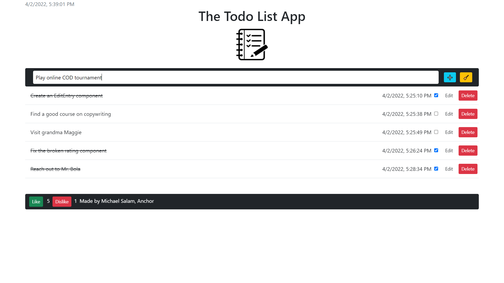
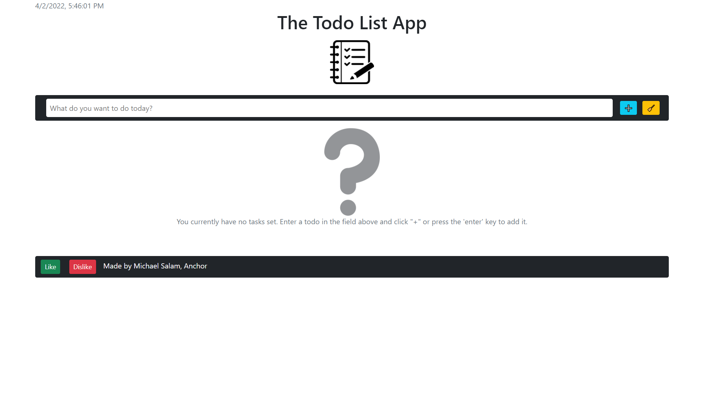

# react-todo-list

A simple todo list app built with ReactJS and Bootstrap.

## Screenshots

## Functionality

This app has basic functionality such as:

- Creating an entry
- Editing an entry
- Deleting an entry
- Shows the date and time added
- Shows the current date and time

As extra functionality, it has a like/dislike counter.

The app persists data through localStorage.

## Built with

- [React](https://reactjs.org/) - JS library
- Bootstrap

## Author

Michael Salam 😁

- YouTube - [Anchor Coding](https://www.youtube.com/channel/UCPmdgwa3zes0eFtPJdbh1LA)
